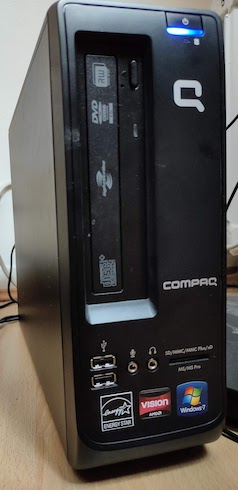

# bunsen-kodi

A place for me to keep notes whilst setting up an elderly Compaq CQ1000 PC as a Linux media server.

PC Specs:
AMD E-450 CPU with 6GB RAM

## Install Linux

Installation of [BunsenLabs Linux](https://www.bunsenlabs.org/) has already been covered [here](bunsen-retrogaming.md)

## Install Kodi

   * Used to be called [XBMC](https://github.com/xbmc/xbmc) - installation on Linux documented [here](https://kodi.wiki/view/HOW-TO:Install_Kodi_for_Linux#Debian)
   
## TODO

Check:

* DVD
* Stream from NAS
* Stream from Netflix, Disney+, Prime
