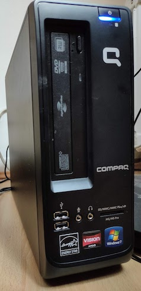

# bunsen-retrogaming

A place for me to keep notes whilst setting up an elderly Compaq CQ1000 PC as a Linux media server and general improvement over a Model B Raspberry Pi retrogaming machine.

PC Specs:
AMD E-450 CPU with 6GB RAM



## 1. Install Linux

[BunsenLabs Linux](https://www.bunsenlabs.org/) was the first Linux variant that could boot and install a bootable system on this elderly hardware (MBR required on harddisk)

Lithium is fine for compiling and installing [RetroPie](https://retropie.org.uk/); cannot compile current [Dolphin](https://dolphin-emu.org/)

Currently installing [Beryllium](https://github.com/BunsenLabs/bunsen-netinstall)

## 2. Allow remote connections

Objectives: 
* Need to install additional software via ssh rather than have multiple screens/keyboards on my desk.

* Copy files via Samba - [I found this page helpful](https://linuxconfig.org/how-to-set-up-a-samba-server-on-debian-10-buster)

```
sudo apt-get update
sudo apt install openssh-server ufw samba
sudo ufw allow ssh
sudo ufw allow samba
```

## 3. Compile and Install RetroPie

Follow instructions for compiling and installing [RetroPie](https://retropie.org.uk/)

## 4. Make Linux more friendly

1. **Power Manager** (Preferences / Power Management)
   * **General** When power button is pressed: *Shutdown*
   * **Display** *disable power management*
   * **Security** *never lock session*

2. **Autologin**
   * Follow [instructions on wiki.debian.org](https://wiki.debian.org/LightDM#Enable_autologin)

3. **Autostart**
   *Create a .desktop file for emulationstation in /usr/share/applications then copy that file to ~/.config/autostart
copy sections of the org.gnome.Terminal.desktop file and change the line that goes Exec=gnome-terminal to Exec=gnome-terminal --command "/?/?/emulationStation".

4. configure Samba
make a link to the RetroPie ROMS directory

## 5. Add Dolphin

Follow instructions for compiling and installing [Dolphin](https://dolphin-emu.org/) (this currently fails due to gcc 9 not being available on Lithium)

## X. TODO

1. Slow down SNES
50 FPS output to 60MHz screen
/opt/retropie/configs/all/retroarch.cfg video_vsync = true

2. Add browser to RetroPie?
