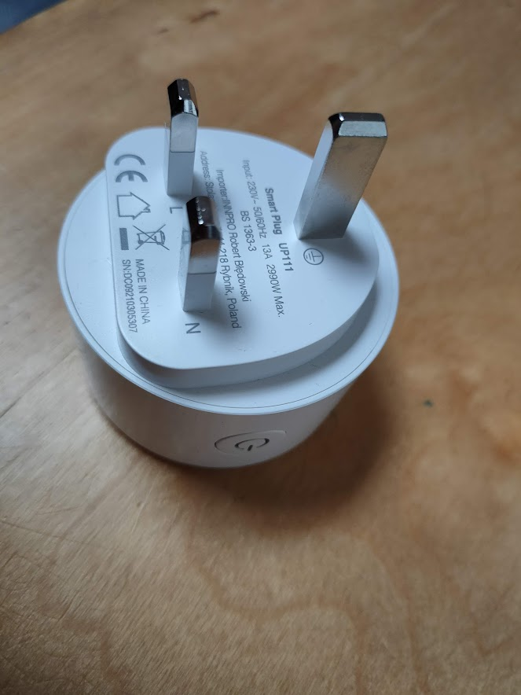

# Installing Tasmota on a Gosund UP111 Smart Plug

These plugs were my introduction to home automation.

## Setup plugs

This [YouTube video](https://www.youtube.com/watch?v=ITNDp2Rk_Ac?t=342) covered everything for the process of flashing Smart Plugs and other devices using Tuya-Convert.

The hardest part for me was finding a flavour of Linux that worked on an Asus X540S laptop - [Mint](https://linuxmint.com/) - as my Raspberry Pi doesn't have WiFi

On the fresh Linux install, open a terminal and:

1. Install git `sudo apt-get install git`
2. Clone the repo `git clone https://github.com/ct-Open-Source/tuya-convert`
3. `cd tuya-convert`
4. Install prerequisits `sudo ./install_prereq.sh`

Now you're ready to flash:
1. `cd tuya-convert`
2. run flash `sudo ./start_flash.sh`
   * Terminate any processes when prompted to
   * Sometimes this needs more than one attempt
3. Connect a smartphone to the AP vtrust-flash
4. Plug in smart plug and press power button for 10 seconds to put into  pairing mode

* Gotchas

## TODO

Check:

* how much does the washing machine cost?
