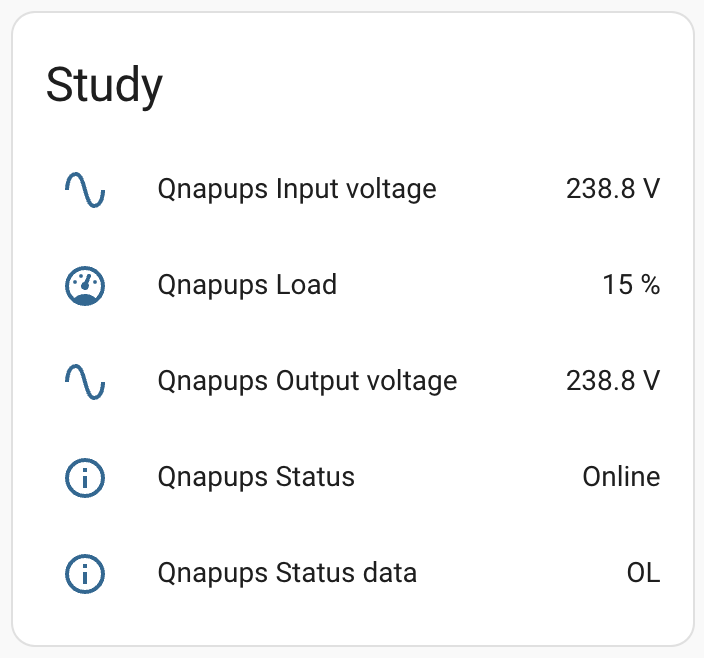
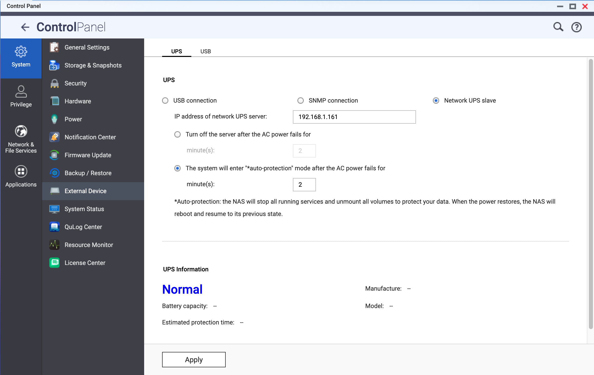

# Set up & Monitor your UPS: QNAP, Proxmox & Home-Assistant

We get one or two very short (under 10 seconds) power cuts every month.

This knocks out the router, which takes a few minutes to start up, and isn't healthy for our QNAP NAS.

Assuming most UPSs would have a common protocol for talking over USB, I bought a very reasonably priced [Tecnoware ERA PLUS 1200 UPS](https://www.amazon.co.uk/dp/B0BN7Y6QZ7) which turned out to be totally incompatible with QNAP.  This incompatibility has turned out to be really helpful as I have more visibility of the UPS than I would have done.

I already had [Home Assistant](https://www.home-assistant.io/) on a small computer running [Proxmox](https://www.proxmox.com/en/) - thanks [tteck](https://tteck.github.io/Proxmox/) - and with a little digging discovered [NUT (Network UPS Tools)](https://networkupstools.org/).

The page [Set up & Monitor your UPS: Proxmox & Home-Assistant](https://www.thesmarthomebook.com/2022/09/02/setting-up-monitor-your-ups-proxmox-home-assistant/) is really helpful, but it's intended for an APC UPS which (being long-established in the field) is well supported.

## Install and Configure NUT

Installation is well covered in the [page above](https://www.thesmarthomebook.com/2022/09/02/setting-up-monitor-your-ups-proxmox-home-assistant/), so I'll only show the commands and points where I had to diverge...

The **lsusb** command returned

```
Bus 001 Device 004: ID 0001:0000 Fry's Electronics MEC0003
```

So we're fine to install nut...

**nut-scanner -U** returns

```
[nutdev1]
        driver = "nutdrv_atcl_usb"
        port = "auto"
        vendorid = "0001"
        productid = "0000"
        product = "MEC0003"
        vendor = "MEC"
        bus = "001"
```

however using this driver returns a lost communication error, and using any name other than **qnapups** renders the UPS monitor incompatible (again!) with QNAP.  The [QNAP forum](https://forum.qnap.com/viewtopic.php?p=476099&sid=61d539bb056f03fa5f2c853ce3c4737b#p476099) was exceptionally helpful here.

/etc/nut/ups.conf needs to include the following:

```
[qnapups]
driver = nutdrv_atcl_usb
port = auto
desc = "Study UPS"
vendorid = 0001
productid = MEC0003
serial = 0000
```

Otherwise, the smarthomebook page shows everything required.

## Configure Home Assistant

Again, well covered in the [page above](https://www.thesmarthomebook.com/2022/09/02/setting-up-monitor-your-ups-proxmox-home-assistant/): add the integration, fill in the ip address and login details... job done!

The three states I've observed in home assistant are:

* **Online** - this is what we want!
* **On Battery** - this is not ideal, but everything is still available.
* **Unavailable** - hopefully, you only knocked the USB cable out.



## Configure QNAP NAS

This is far simpler than expected - configure as an external device in control panel:



